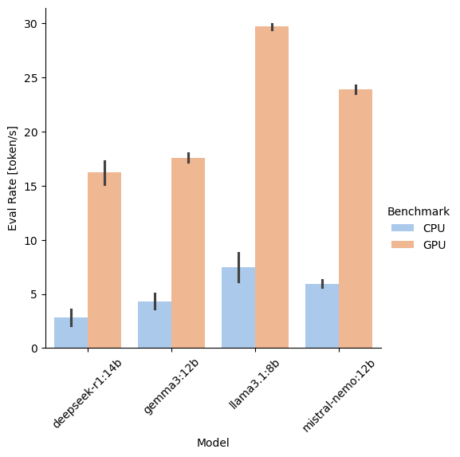

# Ollama Server Benchmark

This Python script can be used to benchmark an Ollama server by sending prompts to different models and measuring various metrics such as duration and token/s. The results are then written to a CSV file for further analysis of the server's performance. The actual response of the model is not evaluated.

The script connects to the Ollama server through the REST API. This allows it to be executed remotely from a different machine, as long as there's network access to the Ollama server. No direct access to the Ollama server itself is required for running this script.

## Installation

This project is using [uv](https://github.com/astral-sh/uv) for management and installation of dependencies.

## Usage

Use the `--help` argument for usage instructions.

```shell
uv run src/main.py --help
uv run src/main.py --server http://ollama.example.com:11434

# Or when using Python 3 directly instead of uv:
python src/main.py --help
```

In this repository, a sample `benchmark.yml` is provided. You can adjust this file to use your own models and you can customize the prompts.

## Output Format

CSV file with the following headers:

* model
* prompt
* created_at: Datetime of the response generation
* total_duration: Time spent generating the response (in seconds)
* load_duration: Time spent loading the model (in seconds)
* eval_duration: Time spent generating the response (in seconds)
* eval_rate: Response token/s
* prompt_eval_duration: Time spent evaluating the prompt (in seconds)
* prompt_eval_rate: Prompt token/s

## Analysis

I also created a [Jupyter Notebook for some basic analysis](analysis/benchmark-analysis.ipynb) of the resulting CSV files if you want to compare multiple benchmarks. Here's an example comparison of token/s for my Ollama server using a Tesla T4 GPU and CPU-only:



## Development

```shell
uv tool run ruff check
uv tool run ruff format
```
